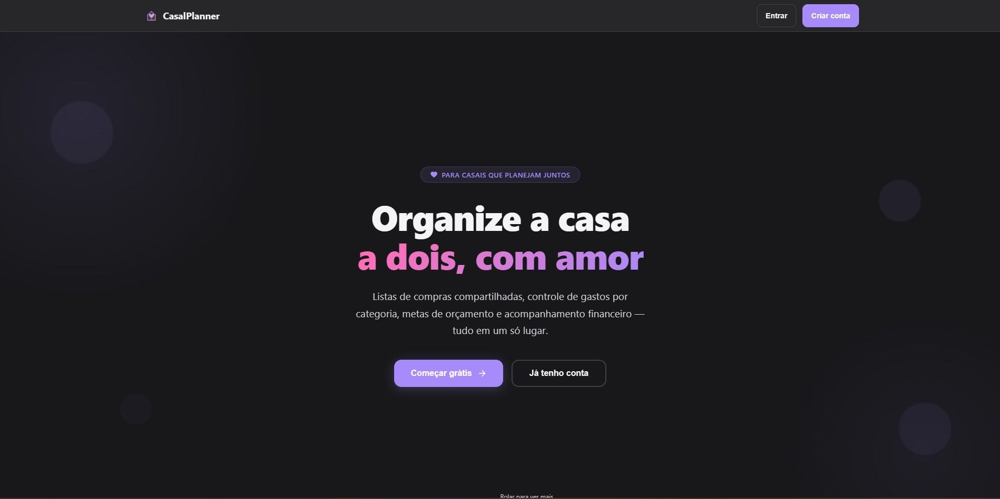

# Matheus Rafael — Portfólio

🔗 **Live:** [matheusrafadev.github.io/portfolio](https://matheusrafadev.github.io/portfolio/)

Site pessoal com meus projetos, experiência e formação. Construído do zero, sem frameworks — HTML, CSS e JavaScript puros — com foco em performance, SEO e i18n (PT/EN).



## ✨ Destaques

- **Vanilla JS**, sem build step — carrega rápido, sem dependências de runtime.
- **i18n PT/EN** com troca de idioma client-side, incluindo datas de experiência calculadas dinamicamente a partir das datas de início/fim de cada cargo.
- **SEO**: meta tags Open Graph/Twitter Card, JSON-LD (`schema.org/Person`), `sitemap.xml` e `robots.txt`.
- **Acessível**: `lang` do documento sincronizado com o idioma ativo, `alt` em todas as imagens, `prefers-reduced-motion` respeitado no CSS.

## 🛠️ Stack

`HTML5` · `CSS3` (custom properties, grid/flexbox) · `JavaScript` (Intersection Observer para animações on-scroll e nav ativa) · `Font Awesome`

## 📂 Estrutura

```
├── index.html          # markup + conteúdo (data-i18n para tradução)
├── index.js            # i18n, cálculo de datas/experiência, scroll spy, fade-in
├── style.css            # design system (variáveis, temas)
├── assets/
│   ├── curriculos/     # currículos em PDF (C#, Java, TypeScript)
│   ├── logos/          # logos das empresas/projetos
│   └── telas/          # screenshots dos projetos
├── robots.txt
└── Sitemap.xml
```

## 🚀 Rodando localmente

Não há build — é só abrir o `index.html`. Recomendo servir com Live Server para os caminhos relativos funcionarem sem CORS:

```bash
git clone https://github.com/MatheusRafaDev/portfolio.git
cd portfolio
npx serve .
```

## 📫 Contato

- E-mail: rafaelmatheus061@gmail.com
- LinkedIn: [/in/matheus-rafael-50a676219](https://www.linkedin.com/in/matheus-rafael-50a676219/)
- GitHub: [@MatheusRafaDev](https://github.com/MatheusRafaDev)
